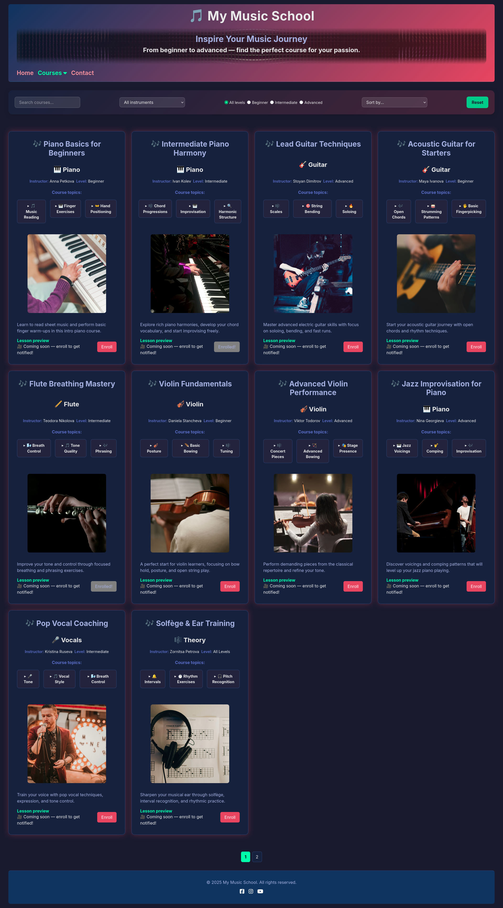

# Music School Learning Platform 🎵

---

## 📚 Table of Contents
- [Music School Learning Platform 🎵](#music-school-learning-platform-)
  - [📚 Table of Contents](#-table-of-contents)
  - [📚 About](#-about)
  - [📦 Prerequisites](#-prerequisites)
  - [🌐 Live Demo](#-live-demo)
  - [📦🚀 Project Setup](#-project-setup)
  - [📁 Folder Structure](#-folder-structure)
  - [Linting](#linting)
  - [🛠️ Technologies Used](#️-technologies-used)
  - [🧩 Project Features by Requirement](#-project-features-by-requirement)
    - [🧱 HTML \& CSS](#-html--css)
    - [🧠 JavaScript](#-javascript)
    - [🧪 Quality Control](#-quality-control)
    - [🧭 Future Improvements](#-future-improvements)


## <a name="about"></a>📚 About
This is a responsive web application project for a music school learning platform, built using HTML, Sass (SCSS), and TypeScript. The project also includes a legacy folder with older vanilla JavaScript files for reference. It uses local JSON data to populate course content.



## <a name="prerequisites"></a>📦 Prerequisites

Please install the following:

- [Node.js & npm](https://nodejs.org/)

> All other tools (like Sass, TypeScript, ESLint, and Stylelint) are installed locally via `npm install`.

---

## 🌐 Live Demo

🔗 [Click here to view the deployed app](https:)


## <a name="project-setup"></a>📦🚀 Project Setup

1. Clone the repository
2. Open the folder in VS Code
3. Initialize and install dependencies:
   ```bash
   npm install
 ```
4. Compile Sass files:
   ```bash
   npm run compile
   ```
5. Compile TS files:
   ```bash
   npm run build:ts
   ```
6. Right-click `index.html` and choose **"Open with Live Server"**
   > 💡 Requires the [Live Server VS Code extension](https://marketplace.visualstudio.com/items?itemName=ritwickdey.LiveServer)

## 📁 Folder Structure

project-root/
├── src/
│ ├── css/
│ ├── data/
│ ├── images/
│ ├── js-legacy/
│ ├── scss/
│ ├── ts/
│ ├── contact.html
│ ├── gallery.html
│ ├── index.html
├── .gitignore
├── .stylelintignore
├── eslint.config.mjs
├── package-lock.json
├── package.json
├── README.md
├── stylelint.config.cjs
├── tsconfig.json

## Linting

To check code quality:

```bash
npm run lint        # Lint JS and SCSS
npm run lint:js     # Lint JavaScript files
npm run lint:styles # Lint SCSS styles
```

## 🛠️ Technologies Used

- **HTML5** – Semantic markup for structured content
- **Sass (SCSS)** – Modular CSS with variables, mixins, and inheritance
- **TypeScript** – Type-safe JavaScript for maintainable frontend logic
- **Vanilla JavaScript** – Legacy components and lightweight scripting
- **Google Maps Embed API** – Map integration for contact page
- **ESLint & Stylelint** – Code quality and consistency enforcement

## 🧩 Project Features by Requirement

### 🧱 HTML & CSS

- Built with **semantic** HTML5 tags.
- Responsive layout using **CSS Grid** and **Flexbox**.
- Used **SCSS (Sass)** for modular styling and nesting, utilyzing **mixins**, **variables**, and **Sass inheritance**.
- The **"Home"** page (index.html) contains an image slider showcasing highlights and a **responsive** navigation menu.
- The navigation main menu contains a submenu for **"All courses"** and user enrolled courses: **"My courses"**.

### 🧠 JavaScript

- The **"Home"** page **image slider** script allows moving seamlessly through images. 
- The **"Gallery"** page (gallery.html) includes a gallery with course cards. Card content is dynamically injected using JS code.
- Each card displays course metadata such as title, level, and instructor, and also contains course topics with toggleable topic details.
- Each card contains an image that is 300px x 300px on large screens and resizes responsively on smaller screens.
- **Asynchronous** course loading from local JSON data.
- The gallery uses pagination, where each page displays no more than 10 courses and the hidden courses are asynchronously loaded when user clicks the next page button.
- Users can filter courses based on level and instrument, and sort them alphabetically by title, instructor, or level.
- Users can also search for courses by entering search keywords in a search bar.
- A **"Reset"** button allows clearing all filter, sort and search criteria.
- An **"Enroll"** button allows users to enroll in courses. Enrolled courses can be accessed through the **"My Courses"** submenu under the **Courses** menu item.
- Modular structure with reusable utility functions.
- Used **TypeScript** for type safety and better code clarity.
- The **"Contact"** page includes a **Google Map** embedded via iframe and injected using JS.
- User interactions work seamlessly across different screen sizes and devices.

### 🧪 Quality Control
- Implemented ESLint and Stylelint configurations, along with a combined lint script in package.json.

### 🧭 Future Improvements

- Add tab visibility tracking to re-render enrolled courses when returning to the page after long idle periods or navigation events.
